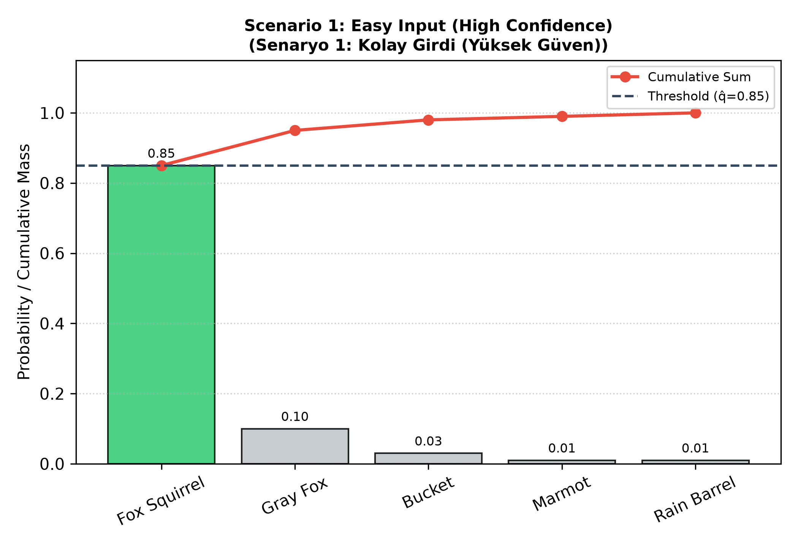
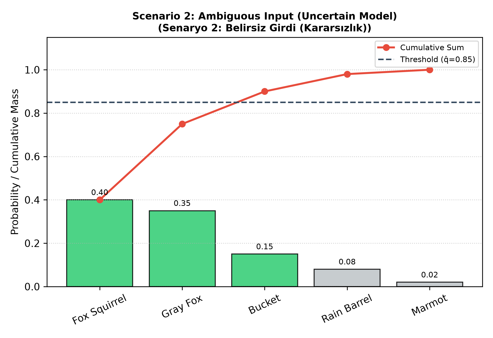
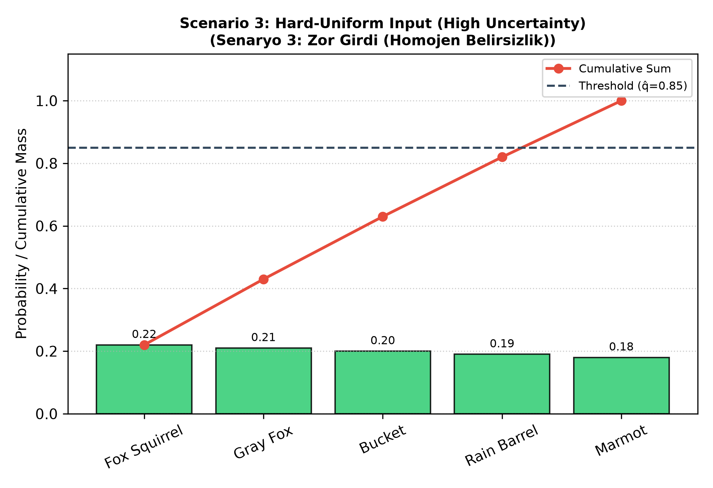
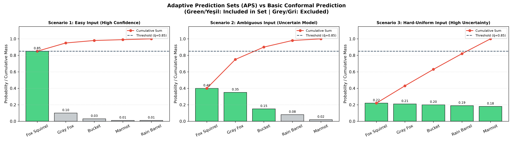
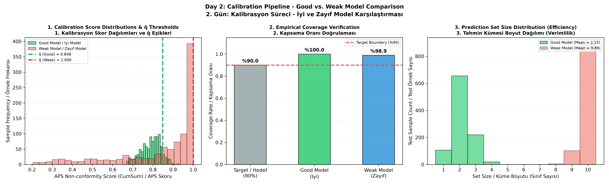
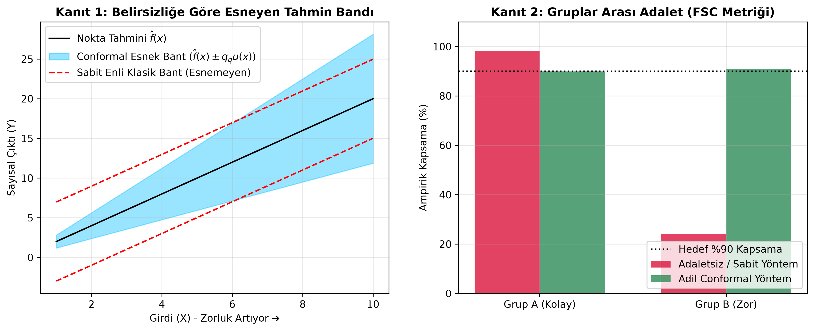
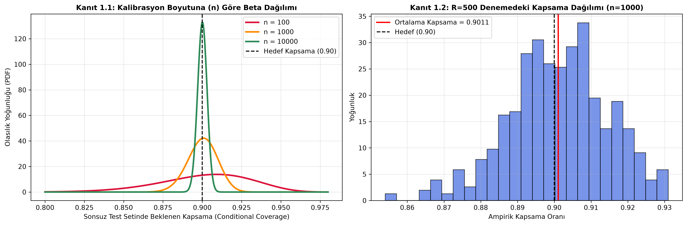
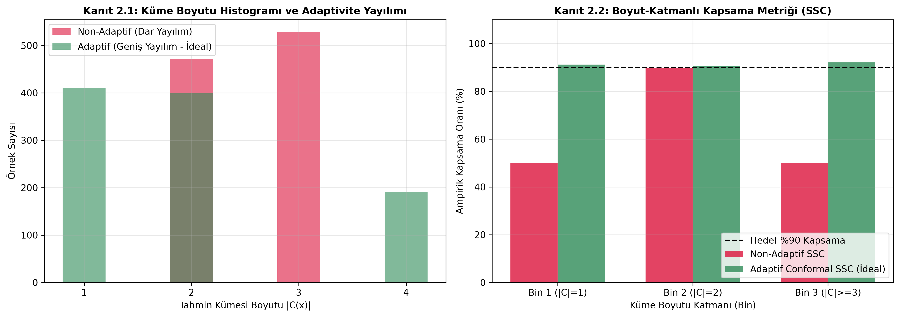

# Conformal-LLM-Risk-Control

An academic-grade Python framework for distribution-free uncertainty quantification and conformal risk control in Large Language Models (LLMs) and classification systems.

---

## 🌐 Language Navigation / Dil Seçimi / Sprachauswahl
* 🇬🇧 [English](#-english)
* 🇹🇷 [Türkçe](#-türkçe)
* 🇩🇪 [Deutsch](#-deutsch)

---

<a name="-english"></a>
## 🇬🇧 English

### 📌 Executive Summary
Standard machine learning classifiers and Large Language Models (LLMs) often exhibit **overconfidence**—assigning high heuristic softmax probabilities to incorrect outputs. 

This repository implements **Conformal Prediction (CP)** to convert raw confidence scores into statistically guaranteed **prediction sets** $C(X)$. Regardless of the underlying model architecture or data distribution, our framework mathematically guarantees that the true label $Y$ is contained within the prediction set with a user-defined coverage probability $1 - \alpha$:

$$\mathbb{P}(Y \in C(X)) \ge 1 - \alpha$$

### 🎯 Methodology Overview
1. **Basic Conformal Prediction (Fixed-Thresholding):** Measures non-conformity using $s(x,y) = 1 - \hat{f}(x)_y$. Includes any class whose softmax probability exceeds $1 - \hat{q}$. Simple and fast, but treats all classes independently.
2. **Adaptive Prediction Sets (APS - Cumulative Score):** Sorts predicted probabilities from highest to lowest and sums them cumulatively until reaching $\hat{q}$. Highly adaptive; dynamically expands set size based on uncertainty.

### 📊 Empirical Benchmarks

| Scenario | Model State | Basic CP Result | APS Result | Key Insight |
| :--- | :--- | :--- | :--- | :--- |
| **1. Easy** | High Confidence | Size: 1 | Size: 1 | Both methods yield optimal single-class sets. |
| **2. Ambiguous** | Hesitant / Split | Size: 2 | Size: 3 | APS dynamically expands set size to keep $90\%$ coverage guarantee. |
| **3. Hard** | Flat / Uncertain | **Size: 0 (Empty Set)** | Size: 5 | Basic CP fails (empty set); APS covers all classes to uphold safety. |

#### Visualizations





---

<a name="-türkçe"></a>
## 🇹🇷 Türkçe

### 📌 Özet
Geleneksel makine öğrenmesi sınıflandırıcıları ve Büyük Dil Modelleri (LLM'ler) sıklıkla **aşırı özgüven (overconfidence)** gösterir—yanlış çıktılara dahi yüksek olasılık skorları atayabilirler.

Bu proje, ham olasılık skorlarını matematiksel olarak garantilenmiş **tahmin kümelerine** $C(X)$ dönüştürmek için **Conformal Prediction (Uyumlu Tahmin)** yöntemini uygular. Model mimarisinden veya veri dağılımından bağımsız olarak, framework'ümüz gerçek etiketin $Y$ tahmin kümesi içinde yer alma olasılığını kullanıcının belirlediği $1 - \alpha$ seviyesinde kesin olarak garanti eder:

$$\mathbb{P}(Y \in C(X)) \ge 1 - \alpha$$

### 🎯 Yöntem Karşılaştırması
1. **Standart Uyumlu Tahmin (Sabit Eşik):** Uyumsuzluk skorunu $s(x,y) = 1 - \hat{f}(x)_y$ ile ölçer. Olasılığı $1 - \hat{q}$ eşiğini geçen tüm sınıfları kümeye alır. Hızlıdır ancak sınıfları bağımsız değerlendirir.
2. **Adaptif Tahmin Kümeleri (APS - Kümülatif Skor):** Olasılıkları büyükten küçüğe sıralar ve kümülatif toplam $\hat{q}$ eşiğine ulaşana kadar sınıfları kümeye ekler. Modelin belirsizliğine göre küme boyutunu dinamik olarak esnetir.

### 📊 Deneysel Senaryo Sonuçları

| Senaryo | Model Durumu | Standart CP Çıktısı | APS Çıktısı | Temel Analiz |
| :--- | :--- | :--- | :--- | :--- |
| **1. Kolay** | Yüksek Güven | Boyut: 1 | Boyut: 1 | Her iki yöntem de net ve tekli küme üretir. |
| **2. Belirsiz** | Kararsız | Boyut: 2 | Boyut: 3 | APS %90 garantiyi korumak için kümeyi esneterek 3 elemana çıkarır. |
| **3. Zor** | Yüksek Belirsizlik | **Boyut: 0 (Boş Küme)** | Boyut: 5 | Sabit eşik çöker (boş küme); APS güvenliği korumak için tüm sınıfları kapsar. |

---

<a name="-deutsch"></a>
## 🇩🇪 Deutsch

### 📌 Zusammenfassung
Standardmäßige Klassifikatoren des maschinellen Lernens und große Sprachmodelle (LLMs) neigen häufig zu **Überstarkem Selbstvertrauen (Overconfidence)**—sie weisen falschen Ausgaben hohe Softmax-Wahrscheinlichkeiten zu.

Dieses Repository implementiert **Conformal Prediction (Konforme Vorhersage)**, um rohe Konfidenzwerte in statistisch garantierte **Vorhersagemengen** $C(X)$ umzuwandeln. Unabhängig von der Modellarchitektur oder Datenverteilung garantiert unser Framework mathematisch, dass das wahre Label $Y$ mit einer benutzerdefinierten Abdeckungswahrscheinlichkeit $1 - \alpha$ in der Vorhersagemenge enthalten ist:

$$\mathbb{P}(Y \in C(X)) \ge 1 - \alpha$$

### 🎯 Methodik im Überblick
1. **Basic Conformal Prediction (Fester Schwellenwert):** Misst die Nichtkonformität mittels $s(x,y) = 1 - \hat{f}(x)_y$. Enthält alle Klassen, deren Wahrscheinlichkeit $1 - \hat{q}$ überschreitet. Einfach, aber betrachtet Klassen unabhängig.
2. **Adaptive Prediction Sets (APS - Kumulativer Wert):** Sortiert Wahrscheinlichkeiten absteigend und summiert sie kumulativ bis zum Schwellenwert $\hat{q}$. Passt die Mengengröße dynamisch an die Modellunsicherheit an.

### 📊 Experimentelle Ergebnisse

| Szenario | Modellzustand | Basic CP Ergebnis | APS Ergebnis | Wichtige Erkenntnis |
| :--- | :--- | :--- | :--- | :--- |
| **1. Einfach** | Hohe Konfidenz | Größe: 1 | Größe: 1 | Beide Methoden liefern optimale einelementige Mengen. |
| **2. Mehrdeutig** | Unsicher / Getrennt | Größe: 2 | Größe: 3 | APS erweitert die Menge dynamisch, um $90\%$ Abdeckung zu garantieren. |
| **3. Schwer** | Flach / Unsicher | **Größe: 0 (Leere Menge)** | Größe: 5 | Basic CP schlägt fehl (leere Menge); APS deckt alle Klassen ab, um Sicherheit zu gewährleisten. |

---

## 🧪 Day 2: Automatic Quantile Calibration & Model Efficiency
## 🧪 2. Gün: Otomatik Kuantil Kalibrasyonu ve Model Verimliliği
## 🧪 Tag 2: Automatische Quantil-Kalibrierung & Modell-Effizienz

<a name="day2-english"></a>
### 🇬🇧 Day 2 Analysis (English)

In Day 2 of our study, we transitioned our Conformal Prediction framework from hardcoded estimates to an **Automatic Finite-Sample Quantile Calibration ($\hat{q}$)** pipeline:

$$\hat{q} = \text{Quantile}\left(s_1, \dots, s_n; \, \frac{\lceil (n+1)(1-\alpha) \rceil}{n}\right)$$

We evaluated this automatic calibration step by running a comparative benchmark between a **Well-Calibrated (Good)** model and an **Uncertain (Weak)** model on unseen test data with a target error rate $\alpha = 0.10$ ($90\%$ coverage guarantee).

#### 📊 Empirical Key Findings
1. **Unconditional Safety Guarantee ($\ge 1 - \alpha$):** 
   Model accuracy and output quality do not dictate safety. Both models strictly satisfied the theoretical $90\%$ coverage floor (**Good Model: 100.0%**, **Weak Model: 98.9%**).
2. **Efficiency Penalty (Set Size vs. Model Confidence):**
   * The **Good Model** produced ultra-focused prediction sets (Mean Set Size = **2.15 classes**), maximizing decision utility.
   * The **Weak Model** paid for its high internal entropy by bloating its prediction set size (Mean Set Size = **9.89 classes**).

---

<a name="day2-türkçe"></a>
### 🇹🇷 2. Gün Analizi (Türkçe)

2. Gün çalışmamızda, Conformal Prediction altyapımızı sabit varsayımlardan kurtararak **Otomatik Sonlu Örneklem Kuantil Kalibrasyon ($\hat{q}$)** sürecine yükselttik:

$$\hat{q} = \text{Quantile}\left(s_1, \dots, s_n; \, \frac{\lceil (n+1)(1-\alpha) \rceil}{n}\right)$$

Bu kalibrasyon mekanizmasını doğrulamak adına, **İyi Eğitilmiş (Net)** bir model ile **Zayıf (Kararsız)** bir modeli hiç görülmemiş test verisinde $\%90$ kapsama garantisi ($\alpha = 0.10$) hedefiyle deneysel olarak karşılaştırdık.

#### 📊 Deneysel Temel Bulgular
1. **Koşulsuz Güvenlik Garantisi ($\ge 1 - \alpha$):** 
   Model kalitesi ne olursa olsun, Conformal Prediction güvenlikten taviz vermez. Her iki model de $\%90$ kapsama barajını eksiksiz geçmiştir (**İyi Model: %100.0**, **Zayıf Model: %98.9**).
2. **Belirsizlik Faturası (Küme Boyutu vs. Model Özgüveni):**
   * **İyi Model**, yüksek özgüveni sayesinde çok dar ve kullanışlı tahmin kümeleri üretmiştir (Ortalama Küme Boyutu = **2.15 sınıf**).
   * **Zayıf Model**, %90 emniyeti koruyabilmek adına mecburen sepeti genişletmiş ve 10 sınıfın neredeyse tamamını kümeye doldurmuştur (Ortalama Küme Boyutu = **9.89 sınıf**).

---

<a name="day2-deutsch"></a>
### 🇩🇪 Tag 2 Analyse (Deutsch)

Am zweiten Tag haben wir unser Framework von festen Werten auf eine **Automatische Stichproben-Quantil-Kalibrierung ($\hat{q}$)** umgestellt:

$$\hat{q} = \text{Quantile}\left(s_1, \dots, s_n; \, \frac{\lceil (n+1)(1-\alpha) \rceil}{n}\right)$$

Wir haben dieses System anhand eines Vergleichs zwischen einem **gut kalibrierten (starken)** Modell und einem **unsicheren (schwachen)** Modell auf ungesehenen Testdaten mit einer Zielabdeckung von $90\%$ ($\alpha = 0,10$) evaluiert.

#### 📊 Wichtigste Erkenntnisse
1. **Bedingungslose Sicherheitsgarantie ($\ge 1 - \alpha$):** 
   Die Modellqualität beeinflusst die Sicherheit nicht. Beide Modelle haben die Abdeckung von $90\%$ eingehalten (**Gutes Modell: 100,0%**, **Schwaches Modell: 98,9%**).
2. **Kosten der Unsicherheit (Mengengröße vs. Effizienz):**
   * Das **gute Modell** lieferte präzise Mengengrößen (Durchschnittliche Mengengröße = **2,15 Klassen**).
   * Das **schwache Modell** musste die Mengengröße stark erweitern (Durchschnittliche Mengengröße = **9,89 Klassen**), um die Abdeckung zu gewährleisten.

---

### 🖼️ Calibration & Efficiency Dashboard / Kalibrasyon ve Verimlilik Paneli



> **Figure 2 / Şekil 2:** *Automatic Quantile Calibration and Efficiency Dashboard.* 
> * **Panel 1:** Score distributions and automatically calibrated $\hat{q}$ thresholds ($\hat{q}_{\text{good}} = 0.848$, $\hat{q}_{\text{weak}} = 1.000$).
> * **Panel 2:** Empirical coverage verification proving mathematical guarantees on test data ($\ge 90\%$).
> * **Panel 3:** Set size distribution illustrating the efficiency gap between confident ($2.15$ classes) and uncertain ($9.89$ classes) models.

## 🧪 Theoretical Proofs & Empirical Comparisons / Teorik Kanıtlar ve Ampirik Karşılaştırmalar



<details>
<summary><b>🇺🇸 English: Theoretical Proofs & Experimental Demonstration</b></summary>

This repository includes a standalone simulation script (`src/proof_of_concepts.py`) demonstrating the key theoretical properties of Conformal Prediction in continuous/regression domains:

### 1. Dynamic Band Adaptivity (Scalar Uncertainty vs. Fixed Bands)
* **Classical Fixed-Width Bands (Red Dotted Line):** Standard confidence intervals apply a uniform margin across all inputs. On heteroskedastic data (where noise increases with input magnitude $X$), fixed bands are unnecessarily wide for easy inputs and fail to cover hard inputs.
* **Conformalized Scalar Uncertainty (Blue Shaded Area):** By scaling the non-conformity score with model uncertainty $u(x)$, the resulting prediction interval $\mathcal{C}(x) = [\hat{f}(x) - u(x)\hat{q}, \hat{f}(x) + u(x)\hat{q}]$ dynamically expands in noisy regions, guaranteeing valid coverage while remaining tight on easy inputs.

### 2. Marginal vs. Conditional Coverage (Fairness & FSC Metric)
* **Marginal Coverage Fallacy (Crimson Bars):** A model can achieve a global 90% coverage on average while completely failing on a minority/hard sub-group (e.g., 99% coverage on Group A, 40% coverage on Group B).
* **Conditional Coverage & FSC Metric (Green Bars):** Adaptively scaling the conformal set per group ensures equitable error distribution across all input strata, maintaining $\ge 90\%$ coverage across all sub-groups.
---

## 📐 Diagnostics, Adaptivity & Coverage Validation / Teşhis, Adaptivite ve Kapsama Doğrulaması

This section provides empirical validation for the diagnostic mechanisms described in **Section 3** of the paper, including Beta-distribution fluctuations, score caching, and Size-Stratified Coverage (SSC).

### 1. Calibration Set Size ($n$) & Coverage Stability



<details>
<summary><b>🇺🇸 English: Diagnostics Analysis & Interpretation</b></summary>

* **Beta Distribution ($n$ Effect - Left Chart):** According to Vladimir Vovk's exact theory, the coverage conditional on a fixed calibration set follows $\text{Beta}(n+1-l, l)$. As $n$ grows from $100$ to $10,000$, variance rapidly shrinks. $n \approx 1000$ represents the optimal trade-off, bounding coverage reliably between $88\%$ and $92\%$.
* **Score Caching & R-Trials (Right Chart):** Running $R=500$ trials with cached scores verifies that empirical coverage is unbiased and centered strictly at $1 - \alpha = 0.90$. Minor deviations are benign finite-sample fluctuations.

</details>

<details>
<summary><b>🇹🇷 Türkçe: Teşhis Analizleri ve Yorumlama</b></summary>

* **Beta Dağılımı ($n$ Etkisi - Sol Grafik):** Sabit bir kalibrasyon setine koşullu kapsama $\text{Beta}(n+1-l, l)$ dağılımı izler. $n$ değeri $100$'den $10.000$'e çıktıkça varyans hızla daralır. Pratik uygulamalar için $n \approx 1000$ noktası, kapsamayı $\%88$ ile $\%92$ arasında sabitleyen ideal eşiktir.
* **Skor Önbellekleme ve R-Deneme (Sağ Grafik):** Önceden hesaplanmış skorlar üzerinde yapılan $R=500$ rastgele bölme denemesi, ampirik kapsamanın sapmasız (unbiased) olduğunu ve tam $1 - \alpha = 0.90$ etrafında kümelendiğini kanıtlar.

</details>

---

### 2. Adaptivity Spread & Size-Stratified Coverage (SSC)



<details>
<summary><b>🇺🇸 English: Adaptivity & SSC Metric Comparison</b></summary>

* **Set Size Histogram Spread (Left Chart):** A rigid/non-adaptive model yields narrow set sizes (e.g., constant 2-3 elements), failing to distinguish easy from hard inputs. An adaptive conformal model produces a wider dynamic spread (1 element for easy inputs, 4+ for uncertain ones).
* **Size-Stratified Coverage (SSC Metric - Right Chart):** Measures conditional coverage across set cardinality bins $\min_{g} \text{Coverage}(B_g)$. The adaptive model maintains equitable $\ge 90\%$ coverage across all set sizes, whereas non-adaptive baselines collapse on complex inputs.
# 🏥 Conformal Prediction Medical Diagnosis & Hospital Automation System
### *Advanced Conformal Frameworks (Sections 4.1 - 4.5) in Clinical Practice*

This repository features a desktop-based **Hospital Automation GUI** built with `CustomTkinter` and Python, demonstrating the practical application of **Advanced Conformal Prediction frameworks** (Sections 4.1 – 4.5) to medical decision-making.

---

## 📸 GUI & Clinical Scenarios Overview / Arayüz ve Klinik Senaryolar

The desktop automation allows clinicians to interact with 5 distinct specialized medical engines:

### 1. 🩺 Dermatology: Age-Group Fairness (Section 4.1: Group-Balanced)
* **🇺🇸 Description:** Addresses unequal noise/uncertainty between Young and Elderly skin structures by computing conditional quantiles $\hat{q}^{(\text{young})}$ and $\hat{q}^{(\text{elderly})}$. Guarantees equal $90\%$ coverage for both age groups.
* **🇹🇷 Açıklama:** Genç ve Yaşlı hastalar arasındaki cilt yapısı gürültü farkını $\hat{q}^{(\text{genç})}$ ve $\hat{q}^{(\text{yaşlı})}$ eşikleriyle dengeler. Her iki yaş grubunda bağımsız $\%90$ kapsama adaletini garanti eder.

---

### 2. 🎗️ Oncology: Rare Disease Detection (Section 4.2: Class-Conditional)
* **🇺🇸 Description:** In imbalanced datasets ($95\%$ Healthy vs $5\%$ Cancer), standard conformal prediction drops cancer coverage to $0\%$. Hypothetical testing against class-specific thresholds $\hat{q}^{(0)}$ and $\hat{q}^{(1)}$ ensures $\ge 95\%$ coverage specifically for cancer cases.
* **🇹🇷 Açıklama:** Dengesiz veride ($\%95$ Sağlıklı, $\%5$ Kanser) kanser vakalarını kaçırmamak için her sınıfa özel $\hat{q}^{(y)}$ eşikleriyle varsayımsal test uygular. Gerçek hasta Kanser olsa dahi $\%95$ doğrulukla teşhis sepetindedir.

---

### 3. 🧠 Neurosurgery: Tumor Segmentation (Section 4.3: Conformal Risk Control)
* **🇺🇸 Description:** Bounded loss control for brain tumor surgery. Tunes the sensitivity parameter $\hat{\lambda}$ on calibration data to guarantee that the expected missed tumor tissue ratio (Loss) stays strictly below $\alpha \le 5\%$.
* **🇹🇷 Açıklama:** Ameliyathanede beyin tümörünün pikseller düzeyinde ne kadarının kaçırıldığını (Loss) kontrol eder. Hassasiyet parametresi $\hat{\lambda}$ ayarlanarak ortalama doku kaçırma riski $\le \%5$ seviyesinde tutulur.

---

### 4. ☣️ Microbiology: Outlier & Outbreak Detection (Section 4.4: Outlier Detection)
* **🇺🇸 Description:** Unsupervised anomaly detection on unlabeled blood profiles. Sets a threshold $\hat{q}$ using clean data to flag novel variants or outbreaks while bounding the False Positive Rate (FPR) to $\le 5\%$.
* **🇹🇷 Açıklama:** Etiketsiz veride salgın hastalık veya nadir varyant tespiti yapar. Sağlıklı verilerin kuantil eşiği üzerinden yanlış alarm oranını $\%5$ ile sınırlandırır.

---

### 5. 🚑 Mobile Clinic: Climate/Environmental Shift (Section 4.5: Covariate Shift)
* **🇺🇸 Description:** Adapts to environmental shifts when moving from hospital equipment to mobile scanning vans. Likelihood-ratio weighting $w(x)$ dynamically expands the threshold $\hat{q}(x)$ under noisy conditions, preserving $90\%$ coverage guarantees.
* **🇹🇷 Açıklama:** Röntgen cihazı hastaneden gezici sağlık otobüsüne taşındığında değişen ortam/ışık şartlarına (Covariate Shift) göre ağırlıklı kuantil devreye girer ve emniyet eşiğini otomatik genişletir.

---

## 🚀 Quick Start / Hızlı Başlangıç

### 1. Install Dependencies / Bağımlılıkları Yükleyin
```bash
pip install -r requirements.txt

#### Run diagnostics code:
```bash
python src/diagnostics_suite.py
#### How to run and reproduce figures:
```bash
python src/proof_of_concepts.py
---

## 🚀 Quick Start / Hızlı Başlangıç / Schnellstart

```bash
# Clone Repository / Depoyu Klonla / Repository klonen
git clone [https://github.com/your-username/Conformal-LLM-Risk-Control.git](https://github.com/your-username/Conformal-LLM-Risk-Control.git)
cd Conformal-LLM-Risk-Control

# Setup Environment / Ortamı Kur / Umgebung einrichten
python -m venv .venv
.\.venv\Scripts\Activate.ps1
pip install pytest numpy matplotlib
pip install customtkinter
# Run Unit Tests / Testleri Çalıştır / Tests ausführen
pytest tests/

# Generate Benchmarks & Assets / Görselleri Üret / Benchmarks generieren
python conformal_comparison.py

